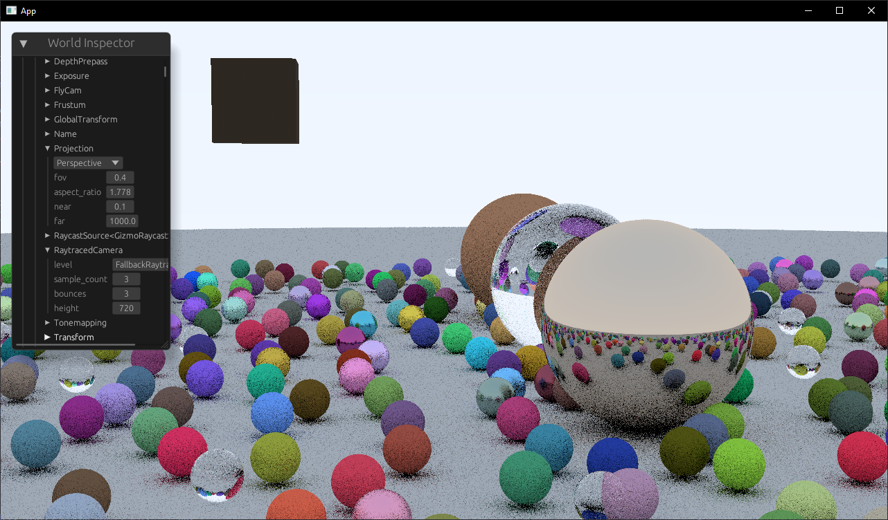

# bevyray

[Ray Tracing in One Weekend](https://raytracing.github.io/) in a [Bevy](https://bevyengine.org) Fragment Shader

## Future work

- set up performance measuring tests
- Meshes (look into how meshlets are integrated) with their own BVH
- More efficient buffer writing (everything is currently copied to storage buffers every frame)
- BVH for the scene
- look into multi-pass techniques and compute shader performance
- properly blend between rasterized and raytraced graphics
- support light sources
- more material features
- denoising
- importance sampling
- integrating with more bevy features
- CI
